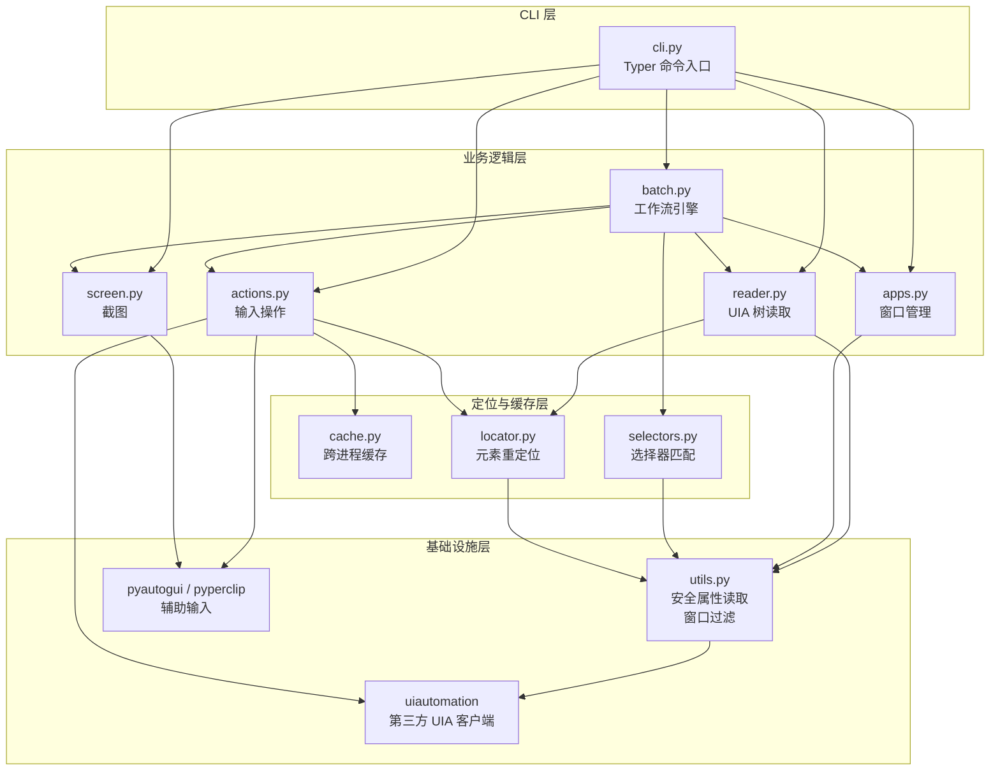
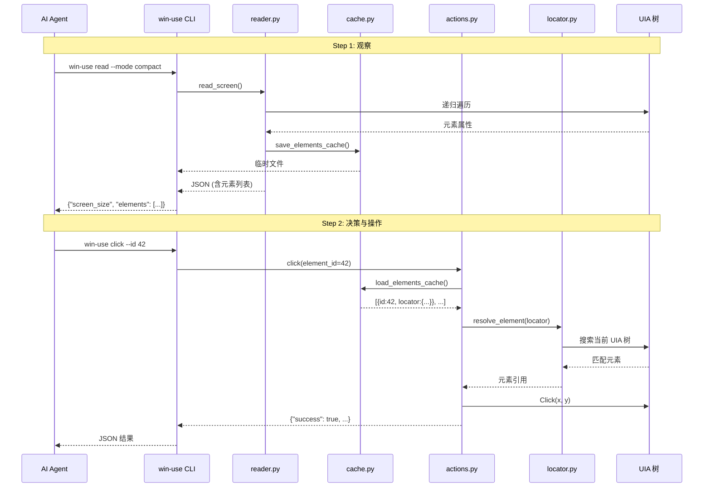
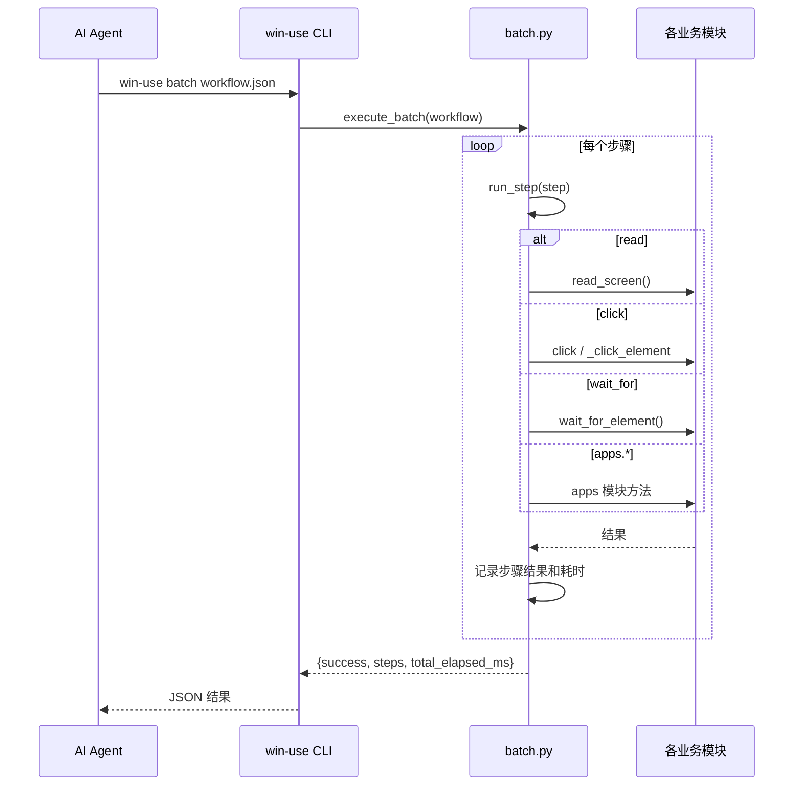

# win-use 设计文档

> **版本**: 0.2.0  
> **语言**: Python 3.10+  
> **平台**: Windows 专属  
> **定位**: 为 AI Agent 提供操控 Windows 桌面的命令行工具

---

## 1. 项目概述

### 1.1 背景与动机

AI Agent 需要一个标准化的接口来观察和操控图形用户界面。在 Windows 平台上，Microsoft UI Automation (UIA) 提供了完整的无障碍树访问能力，但原生 API 复杂、面向 COM，不适合 AI 直接消费。**win-use** 将 UIA 能力封装为简洁的 CLI 命令和结构化 JSON 输出，使任何 AI Agent 都能轻松执行 Windows 桌面自动化任务。

### 1.2 核心能力

| 能力 | 命令 | 说明 |
|------|------|------|
| 观察 | `win-use read` | 读取 UIA 无障碍树，输出结构化 JSON |
| 操作 | `win-use click / type / keys / scroll / drag` | 模拟鼠标键盘操作 |
| 窗口 | `win-use apps list / focus / launch / close` | 窗口与应用生命周期管理 |
| 截图 | `win-use screenshot` | 截取当前屏幕 |
| 批处理 | `win-use batch workflow.json` | 单进程执行多步工作流，支持 `wait_for` 条件等待 |
| 系统 | `win-use shell` | 执行 PowerShell 命令，获取标准输出 |

### 1.3 设计原则

- **AI-First**: 所有输出均为结构化 JSON，无人类可读格式
- **无状态 CLI**: 每个命令独立进程运行；元素定位信息通过临时文件跨进程持久化
- **渐进增强**: 从坐标点击 → ID 点击 → 语义选择器，三种定位策略逐级提升鲁棒性
- **容错优先**: 所有 UIA 属性读取包裹 `try/except`，失败返回默认值而非崩溃

---

## 2. 系统架构

### 2.1 分层架构



### 2.2 模块职责

| 模块 | 职责 | 依赖 |
|------|------|------|
| `cli.py` | CLI 入口，参数解析，命令分发 | 所有业务模块 |
| `reader.py` | 递归遍历 UIA 树，输出 full/compact 两种 JSON | `utils`, `locator` |
| `actions.py` | 点击、输入、按键、滚动、拖拽、等待 | `locator`, `cache`, `uiautomation`, `pyautogui` |
| `apps.py` | 窗口列举、聚焦、启动、关闭、最小化/最大化 | `utils`, `uiautomation` |
| `batch.py` | 工作流 JSON 解析，多步骤顺序执行 | `reader`, `actions`, `apps`, `selectors`, `screen` |
| `screen.py` | 全屏截图，支持文件保存和 base64 输出 | `PIL.ImageGrab` |
| `cache.py` | 元素信息的临时文件持久化（跨 CLI 进程） | 文件系统 |
| `locator.py` | 根据持久化的 locator 在最新 UIA 树中重新定位元素 | `utils` |
| `selectors.py` | 按 name/type/automation_id 等多字段查询元素，支持等待 | `utils` |
| `utils.py` | 安全属性读取、窗口过滤、元素判断、屏幕信息 | `uiautomation` |

---

## 3. 核心模块设计

### 3.1 无障碍树读取 (`reader.py`)

#### 3.1.1 两种输出模式

| 模式 | 说明 | 适用场景 |
|------|------|----------|
| `full` | 完整递归树，保留所有节点及其父子关系 | 调试、诊断、完整上下文理解 |
| `compact` | 仅保留窗口根节点 + 可交互元素（含 patterns 列表） | AI Agent 行动决策，减少 token 消耗 |

**compact 模式的过滤逻辑**:
- 窗口根节点始终保留
- 非交互元素被跳过，但其子元素仍被递归搜索（不丢失深层可交互元素）
- 零尺寸元素（bounds w/h ≤ 0）在 depth > 0 时被跳过

#### 3.1.2 元素数据结构

```json
{
  "id": 42,
  "type": "Button",
  "name": "确定",
  "automation_id": "confirmBtn",
  "bounds": {"x": 100, "y": 200, "w": 80, "h": 30},
  "enabled": true,
  "offscreen": false,
  "children": [43, 44],
  "patterns": ["Invoke"],
  "window_state": "normal"
}
```

#### 3.1.3 自增 ID 机制

- 遍历过程中使用 `id_counter`（列表包装实现闭包可变）为每个保留元素分配递增整数 ID
- ID 在单次 `read` 调用内唯一，跨调用不保证稳定性
- 配合 `cache.py` 实现跨 CLI 进程的"先 read 后 click"模式

### 3.2 元素定位 (`locator.py`)

#### 3.2.1 Locator 结构

```json
{
  "window": {
    "native_window_handle": 123456,
    "name": "记事本",
    "class_name": "Notepad",
    "automation_id": ""
  },
  "path": [0, 2, 1],
  "runtime_id": [42, 123456],
  "name": "确定",
  "class_name": "Button",
  "automation_id": "confirmBtn",
  "type": "Button"
}
```

#### 3.2.2 两阶段重定位策略

```
定位流程:
1. 窗口定位（优先级递减）:
   a. NativeWindowHandle 直接句柄获取
   b. AutomationId 精确匹配
   c. Name 精确匹配
   d. ClassName 精确匹配

2. 元素定位:
   a. 路径定位: 按 locator.path 沿树路径定位，再用 _same_element 校验
   b. 广度搜索: 路径失效时在目标窗口内 BFS 搜索（上限 5000 节点）
      - 优先 RuntimeId 匹配（完全等于）
      - 其次 type + automation_id 匹配
      - 再次 name + class_name 匹配
```

#### 3.2.3 元素一致性校验 (`_same_element`)

校验优先级:
1. `runtime_id` 完全相等 → 精确匹配
2. `type` 相同 + `automation_id` 非空且相等
3. `name` 相同 + 可选 `class_name` 相同
4. 仅 `class_name` 相同

### 3.3 跨进程缓存 (`cache.py`)

#### 3.3.1 设计目标

CLI 每次调用是独立进程，无法在内存中保持状态。需要一种轻量机制使 `read` 和 `click --id N` 跨进程共享元素信息。

#### 3.3.2 实现方案

- **存储位置**: `%TEMP%/win-use/last-read.json`，可通过 `WIN_USE_CACHE_PATH` 环境变量覆盖
- **写入**: `read` 命令完成后写入精简的元素记录（id, bounds, name, type, locator）
- **读取**: `click --id N` 时加载缓存，按 ID 查找 locator，重新解析为当前 UIA 元素
- **原子写入**: 先写临时文件，再 `replace`，避免并发读写脏数据

#### 3.3.3 缓存记录结构

```json
[
  {
    "id": 42,
    "bounds": {"x": 100, "y": 200, "w": 80, "h": 30},
    "name": "确定",
    "type": "Button",
    "locator": { /* 完整 locator */ }
  }
]
```

### 3.4 动作模块 (`actions.py`)

#### 3.4.1 点击（Click）

两种调用模式:
- **坐标点击**: `click(coords=(x, y))` — 直接屏幕坐标
- **元素点击**: `click(element_id=42, elements_cache=cache)` — 先通过缓存 + locator 解析坐标

元素点击的安全检查:
1. locator 解析 → 元素是否存在
2. `IsOffscreen` 检查 → 是否在可视区域
3. bounds 有效性 → 是否有可点击区域
4. 坐标范围 → 是否在屏幕内（|x|, |y| ≤ 30000）

#### 3.4.2 文字输入（Type）

两种输入模式:

| 模式 | 触发条件 | 实现 | 适用场景 |
|------|---------|------|---------|
| 粘贴模式 | `delay == 0` | `pyperclip` 复制 + `Ctrl+V` | 快速输入，保留特殊字符 |
| 逐字模式 | `delay > 0` | `uiautomation.SendKeys` | 需要模拟真实输入速度 |

**引号智能剥离**: AI Agent 经常将文本包裹在引号中传入 CLI。`normalize_text_input` 最多去除三层匹配的成对引号（`""`, `''`, `""`, `''`）。

#### 3.4.3 组合键（Keys）

使用 `uiautomation.SendKeys` 的格式化字符串语法:

| 示例 | 效果 |
|------|------|
| `{Ctrl}c` | Ctrl+C |
| `{Alt}{F4}` | Alt+F4 |
| `{Win}r` | Win+R |
| `{Enter}` | Enter |

### 3.5 窗口管理 (`apps.py`)

#### 3.5.1 窗口定位

多字段模糊匹配，优先级递减:

```
Name > AutomationId > ClassName
```

每个字段使用**大小写不敏感的包含匹配**。多个候选时通过 `--index` 参数选择。

#### 3.5.2 聚焦窗口

```
1. 按名称查找目标窗口（轮询等待出现，默认超时 2s）
2. 若最小化，先调用 SetWindowVisualState(0) 恢复
3. 调用 WindowPattern.SetWindowVisualState(0) 或 SendKey {Alt} 切换焦点
```

#### 3.5.3 启动应用

```
1. 尝试直接以名称运行（如 "notepad"）
2. 若失败，尝试 shell:AppsFolder 查找并启动 UWP 应用
3. 轮询等待窗口出现（默认超时 2s）
```

### 3.6 批处理引擎 (`batch.py`)

#### 3.6.1 设计动机

独立 CLI 命令模式下，每次 `read` → `click` 需要两个进程，开销大且无法做条件等待。batch 模式在单进程中顺序执行多步操作，每步返回 `success`、`elapsed_ms` 和结构化结果。

#### 3.6.2 支持的操作

```
apps.list / apps.focus / apps.launch / apps.close / apps.minimize / apps.maximize
read / click / double_click / type / keys / scroll / move / drag
wait / wait_for / screenshot
```

#### 3.6.3 工作流结构

```json
{
  "default_timeout": 5.0,
  "default_settle": 0.05,
  "continue_on_error": false,
  "steps": [
    {
      "action": "read",
      "window": "Weixin",
      "active": true,
      "mode": "compact"
    },
    {
      "action": "click",
      "selector": {
        "name": "发送",
        "match": "contains"
      },
      "timeout": 5
    }
  ]
}
```

#### 3.6.4 `wait_for` 条件等待

```json
{
  "action": "wait_for",
  "selector": {"name": "就绪", "visible": true},
  "state": "present",
  "timeout": 10,
  "poll_interval": 0.1,
  "index": 0,
  "depth": 8
}
```

| 参数 | 说明 |
|------|------|
| `selector` | 多字段匹配条件（name/automation_id/class_name/type/enabled/visible） |
| `state` | `"present"` 等待出现 / `"absent"` 等待消失 |
| `timeout` | 超时秒数，超时抛 `TimeoutError` |
| `poll_interval` | 轮询间隔秒数 |
| `index` | 多匹配时选择第几个 |
| `depth` | UIA 树搜索深度 |
| `match` | `"contains"` / `"exact"` / `"starts_with"` / `"ends_with"` |

#### 3.6.5 错误处理

- `continue_on_error: false`（默认）: 任一步骤失败立即终止，返回 `success: false` 和失败步骤信息
- `continue_on_error: true`: 失败步骤记录错误后继续执行剩余步骤，最终 `success` 取决于是否所有步骤成功

### 3.7 选择器系统 (`selectors.py`)

#### 3.7.1 选择器字段

```json
{
  "name": "确定",
  "automation_id": "confirmBtn",
  "class_name": "Button",
  "type": "Button",
  "enabled": true,
  "visible": true,
  "match": "contains"
}
```

所有文本字段支持四种匹配模式:
- `contains`（默认）: 大小写不敏感子串匹配
- `exact`: 大小写不敏感精确匹配
- `starts_with`: 大小写不敏感前缀匹配
- `ends_with`: 大小写不敏感后缀匹配

#### 3.7.2 搜索策略

1. 确定搜索根：指定 window 名称 → 模糊匹配窗口；`active: true` → 活动窗口；否则 → 所有顶层窗口
2. BFS 遍历，最大深度 `max_depth`
3. 每个元素过 `element_matches` 判定

### 3.8 截图模块 (`screen.py`)

- 使用 `PIL.ImageGrab.grab()` 全屏截图
- 支持保存为 PNG/JPEG 文件
- 支持 base64 编码返回，适合 AI 视觉模型消费
- JPEG 质量可配置（默认 85）

---

## 4. 数据流

### 4.1 独立命令模式



### 4.2 批处理模式



---

## 5. CLI 接口设计

### 5.1 命令总览

```
win-use
├── read        # 读取 UIA 无障碍树
│     --window, -w    指定窗口
│     --active, -a    仅活动窗口
│     --depth, -d     递归深度 (default: 4)
│     --mode          full|compact (default: full)
│     --all           包含后台/最小化窗口
│     --output, -o    保存到 JSON 文件
│
├── click       # 点击元素或坐标
│     --id            元素 ID（需先 read）
│     --x, --y        屏幕坐标
│     --button, -b    left|right|middle (default: left)
│     --double        双击
│
├── type        # 输入文字
│     --delay, -d     每字延迟毫秒 (0=粘贴模式)
│     --stdin         从 stdin 读取
│
├── keys        # 发送组合键
│
├── scroll      # 滚动
│     --amount, -a    滚动像素量
│     --x, --y        滚动位置
│
├── move        # 移动鼠标
│
├── drag        # 拖拽
│
├── wait        # 等待秒数
│
├── batch       # 执行工作流
│     --json          内联 JSON
│
├── apps        # 窗口管理
│     list|focus|launch|close|minimize|maximize
│     --index, -n     多匹配选择
│     --timeout, -t   超时秒数
│
├── screenshot  # 截图
│     --output, -o    保存路径
│     --base64, -b    base64 编码
│     --quality, -q   JPEG 质量
│
└── shell       # 执行 PowerShell
```

### 5.2 输出规范

所有命令输出均为 JSON，统一格式:

```json
{
  "success": true,
  "action": "click",
  "...": "..."
}
```

错误输出也保持 JSON 格式，通过 stderr 输出，exit code 非零。

---

## 6. 关键技术决策

### 6.1 为什么选择 uiautomation

| 候选库 | 优势 | 劣势 | 
|--------|------|------|
| **uiautomation** ✅ | 纯 Python，API 简洁，支持所有 UIA 模式 | 文档较少 |
| comtypes 直接调用 | 完全控制 | 代码量巨大，COM 生命周期管理复杂 |
| pywinauto | 成熟稳定 | 对某些现代控件支持不足 |
| Windows UI Automation API (C++) | 官方支持，最高性能 | 非 Python 生态，集成复杂 |

**选型理由**: `uiautomation` 提供了最简洁的 Python 封装，社区活跃，能满足读取 + 操作的核心需求。

### 6.2 跨进程状态管理：缓存文件 vs IPC

| 方案 | 优势 | 劣势 |
|------|------|------|
| **临时文件缓存** ✅ | 实现简单，无后台进程，天然持久化 | 有磁盘 I/O 开销（可忽略） |
| 本地 Socket IPC | 实时性强 | 需要常驻后台进程，复杂度高 |
| 内存映射文件 | 性能好 | Windows 特化，可移植性差 |

**选型理由**: AI Agent 调用频率低（秒级），临时文件的延迟可忽略。无需常驻后台进程，更符合"无状态工具"的设计理念。

### 6.3 三级定位策略

| 级别 | 定位方式 | 优势 | 劣势 |
|------|---------|------|------|
| 1 | 屏幕坐标 `--x --y` | 无依赖，100% 可靠 | 分辨率/DPI 敏感，不支持窗口移动 |
| 2 | 缓存 ID `--id N` | 相对鲁棒 | 需先 read，跨进程缓存 |  
| 3 | 语义选择器 `selector` | 最鲁棒，语义化 | 仅 batch 模式支持，可能有歧义 |

**选型理由**: 渐进增强设计。坐标点击作为保底方案；ID 定位满足大部分场景；语义选择器为复杂工作流提供最佳鲁棒性。

### 6.4 compact 模式的剪枝策略

compact 模式不简单丢弃非交互元素，而是**跳过显示但递归搜索子元素**。这确保：
- 可交互元素不被中间容器隐藏
- token 消耗大幅降低（通常减少 70-90% 节点）
- 窗口层级结构仍然保真（通过 `children` 数组的 ID 引用）

---

## 7. 依赖关系

### 7.1 运行时依赖

| 包 | 版本 | 用途 |
|----|------|------|
| `uiautomation` | ≥2.0 | Windows UIA 客户端核心 |
| `typer` | ≥0.9 | CLI 框架 |
| `Pillow` | ≥9.0 | 截图处理 |
| `pyautogui` | * | 辅助鼠标操作 |
| `pyperclip` | * | 剪贴板粘贴 |

### 7.2 可选依赖

| 包 | 用途 |
|----|------|
| `openai` ≥1.0 | `[vision]` extra: 结合截图的视觉分析 |

---

## 8. 扩展点与未来方向

### 8.1 已预留的扩展点

- **Vision 支持**: `setup.py` 中 `[vision]` extra 已预留，可接入 GPT-4V 等多模态模型分析截图
- **自定义选择器匹配**: `selectors.py` 的 `element_matches` 可扩展新的匹配字段和模式
- **批处理自定义动作**: `SUPPORTED_ACTIONS` 集合可扩展新 action 类型
- **缓存策略可替换**: `WIN_USE_CACHE_PATH` 环境变量允许自定义缓存位置

### 8.2 已知限制

- **仅支持 Windows**: 依赖 UIA，无法跨平台
- **UWP 应用限制**: 部分 UWP 应用 UIA 暴露不完整
- **高 DPI 场景**: 需要额外的 DPI 缩放处理
- **并发安全**: 缓存文件无锁保护，多 Agent 并发需自行协调

### 8.3 未来方向

- MCP (Model Context Protocol) Server 封装，提供标准化的 Agent-桌面交互协议
- 基于视觉 + UIA 的混合定位，提高不可访问元素的定位成功率
- Windows 远程桌面场景下的自动化支持
- 录制回放功能

---

## 附录 A: 示例工作流（微信快速消息）

```json
{
  "default_timeout": 5,
  "default_settle": 0.05,
  "steps": [
    {"action": "apps.maximize", "name": "Weixin"},
    {"action": "apps.focus", "name": "Weixin"},
    {"action": "keys", "keys": "{Ctrl}f"},
    {"action": "type", "text": "长夜无荒", "delay": 0},
    {"action": "click", "window": "Weixin",
      "selector": {"name": "长夜无荒", "match": "contains", "visible": true}
    },
    {"action": "type", "text": "你好", "delay": 0},
    {"action": "keys", "keys": "{Enter}"},
    {"action": "screenshot", "output": "wechat_result.png"}
  ]
}
```

此工作流演示了完整的"打开微信 → 搜索联系人 → 发送消息 → 截图确认"自动化流程。

## 附录 B: 项目文件结构

```
win-use/
├── CLAUDE.md              # AI 上下文说明
├── setup.py               # 包安装配置
├── win-use.md             # 用户文档
├── examples/
│   └── wechat-fast.json   # 示例工作流
├── tests/
│   ├── __init__.py
│   └── test_core.py
└── win_use/
    ├── __init__.py         # 版本号
    ├── cli.py              # CLI 入口
    ├── reader.py           # UIA 树读取
    ├── actions.py          # 模拟操作
    ├── apps.py             # 窗口管理
    ├── batch.py            # 批处理引擎
    ├── screen.py           # 截图
    ├── cache.py            # 跨进程缓存
    ├── locator.py          # 元素重定位
    ├── selectors.py        # 选择器系统
    └── utils.py            # 工具函数
```
